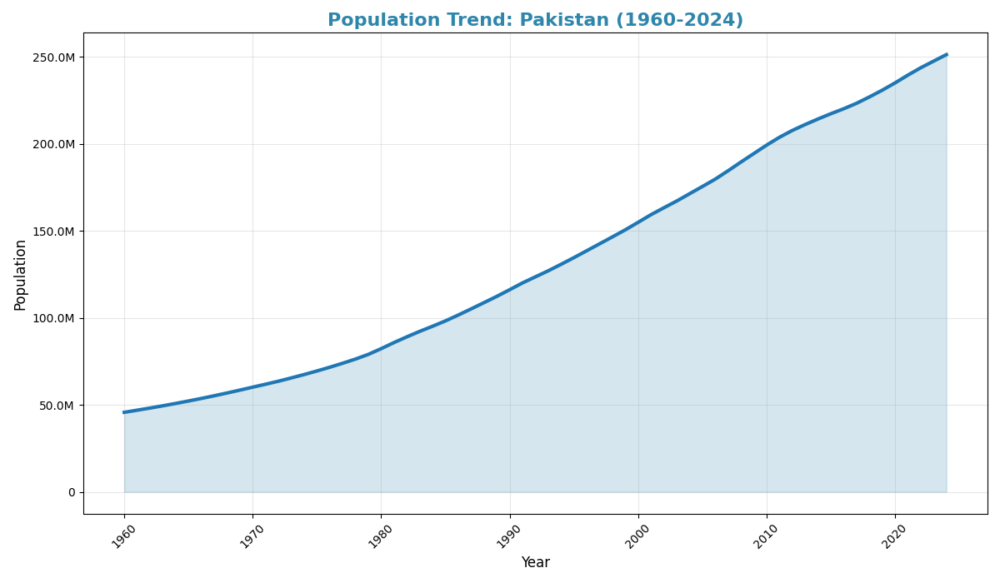
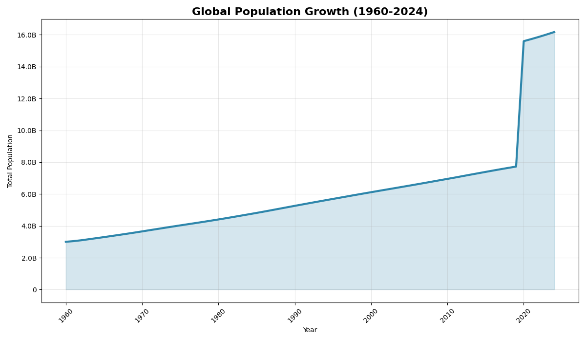
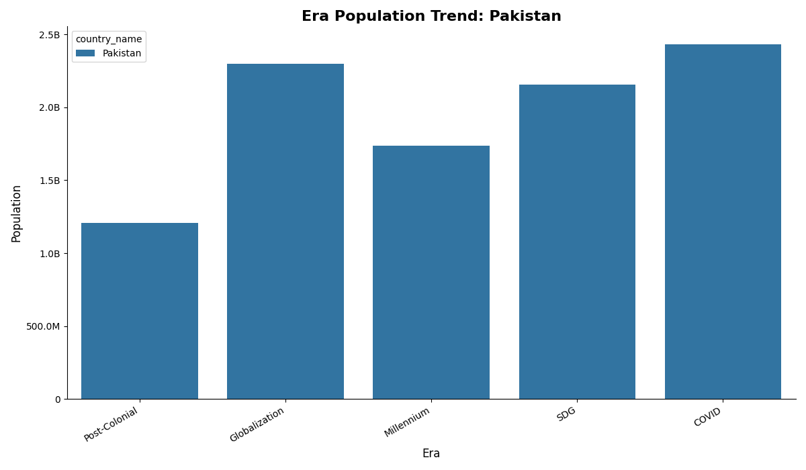
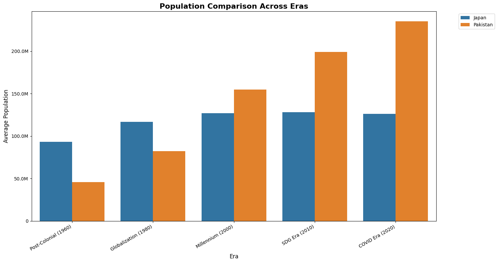

# 🌍 Global Population Trends: A Comparative Analysis Across Eras

## 📖 Overview

This project provides a **menu-driven Python application** for analyzing global and country-level population data between **1960 and 2024**.
It connects to a **MySQL database** and uses **Matplotlib** and **Seaborn** for visualization.

The project supports multiple views of population data, including:

* 📈 **Country Population Trends** (over time)
* 🌐 **Global Population Growth** (total world population by year)
* 🏛️ **Era Analysis** (population aggregated by historical eras for a country)
* ⚖️ **Cross-Era Comparison** (comparison of two countries across multiple eras)

---

## 🛠️ Requirements

### Python Libraries

Install required dependencies with:

```bash
pip install pandas sqlalchemy pymysql matplotlib seaborn
```

### Database

* **MySQL** server (local or remote)
* **Database schema** must include:

  * `Long_Format_Population_Data`
  * `Global_Population_Growth`
  * `Era_Analysis`
  * `Cross_Era_Comparison`
  * (plus a `countries_data` table if you want to validate country inputs)

⚠️ **Note:**
You must construct **your own MySQL connection** inside the script by editing:

```python
username = 'your_username'
password = 'your_password'
host = 'localhost'
port = 3306
database_name = 'your_database_name'
```

---

## ▶️ Usage

1. Run the script:

   ```bash
   python population_analysis.py
   ```

2. Choose from the interactive menu:

   ```
   --- Population Data Analysis Menu ---
   1. View Country Population Trends
   2. View Global Population Growth
   3. View Population by Era (Single Country)
   4. View Cross-Era Comparison (Two Countries)
   5. Exit
   ```

3. Enter input when prompted (country name, year ranges, etc.).

4. Charts are displayed and also saved as **PNG files** in the current directory.

---


## 📊 Example Outputs

* `Pakistan_1960_2024.png` → Line chart of Pakistan’s population over time.
* `global_population_growth.png` → Global population growth chart.
* `India_era_analysis.png` → Bar chart of population across eras for India.
* `India_vs_China_comparison.png` → Side-by-side comparison of two countries across eras.

---

### 🔹 Pakistan Population Trend (1960–2024)

Line chart showing Pakistan’s population growth between 1960 and 2024.


---

### 🔹 Global Population Growth (1960–2024)

Total world population growth trend across years.


---

### 🔹 Era Analysis – Pakistan

Bar chart showing Pakistan’s average population across different historical eras.


---

### 🔹 Cross-Era Comparison – Pakistan vs Japan

Bar chart comparing population across eras between Pakistan and Japan.


---
